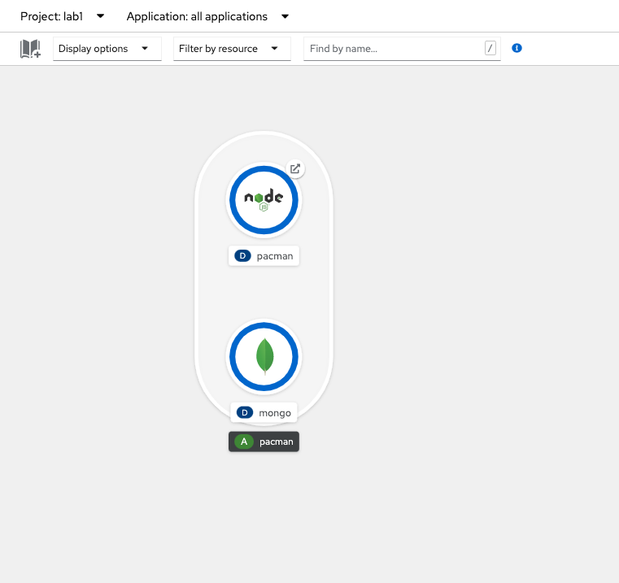
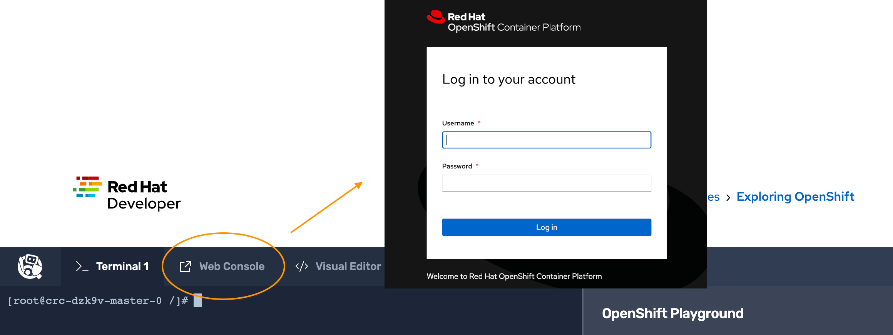
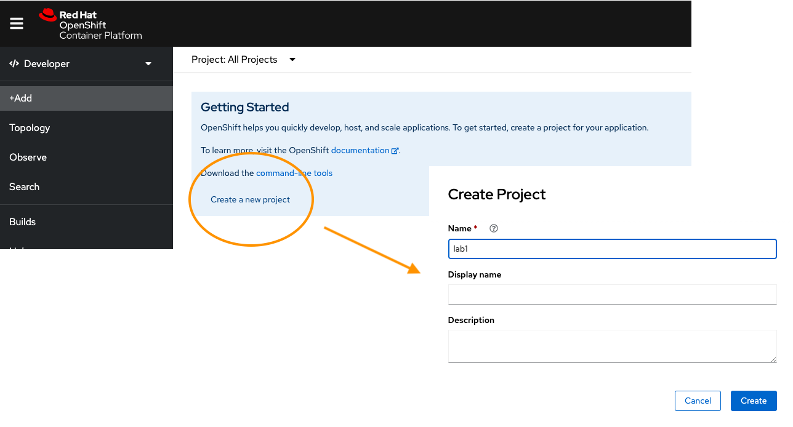
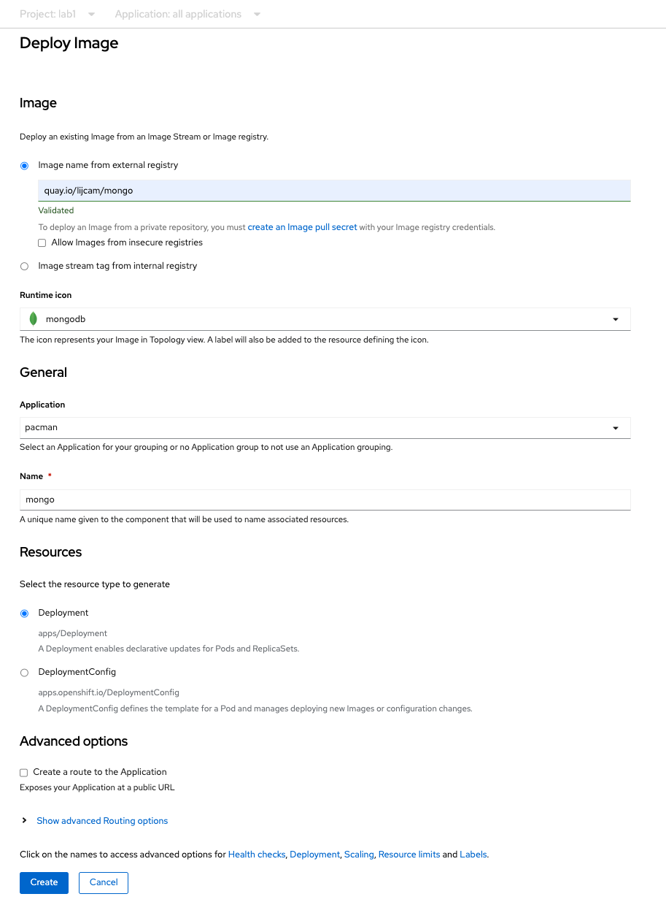
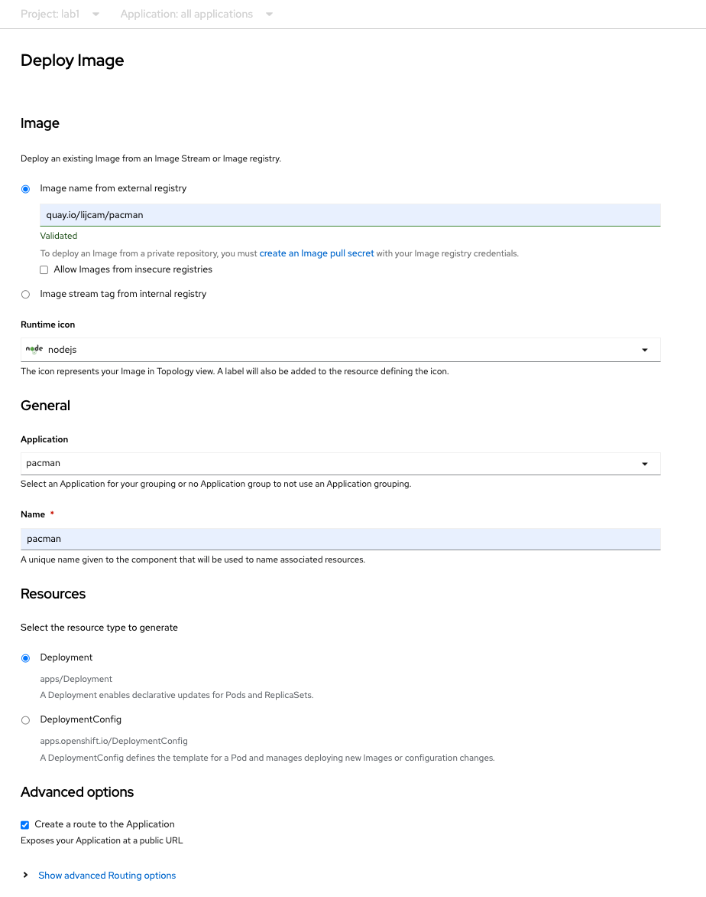

# Deploy the Pacman application

For countless people, including myself, their first experience to Kubernetes can be daunting. With hundreds and lines, and even more directives, It can be challenging to know where to start, what is important in these files. 

OpenShift seeks to simplify the approach to Kubernetes, start with the UI, while learning the cli. 

In this exercise, we will deploy the Pacman application using just the OpenShift console.

In the playground virtual terminal, click the link to the Web Console.

## 1. Create the project

Log into the console with the `developer` user and create a new project by clicking on `create a new project`.

## 2. Deploy the database

Firstly deploy the mongo container image hosted in the `quay.io` registry.

| Configuration                        | Parameter                 |
|--------------------------------------|---------------------------|
| Image name from external registry    | `quay.io/lijcam/mongo:v1` |
| Runtime icon                         | mongodb                   |
| Application                          | pacman                    |
| Name                                 | mongo                     |
| Select the resource type to generate | Deployment                |
| Create a route to the Application    | untick                    |

## 3. Deploy the Pacman application

Followed by deploying the Pacman container image hosted in the `quay.io` registry.

| Configuration                        | Parameter                  |
|--------------------------------------|----------------------------|
| Image name from external registry    | `quay.io/lijcam/pacman:v1` |
| Runtime icon                         | nodejs                     |
| Application                          | pacman                     |
| Name                                 | pacman                     |
| Select the resource type to generate | Deployment                 |
| Create a route to the Application    | tick                       |

From the topology screen, you will notice that the Pacman container has a small arrow symbol to the right of it. This links to the route of the application. Pressing this will take you to the Pacman application.

